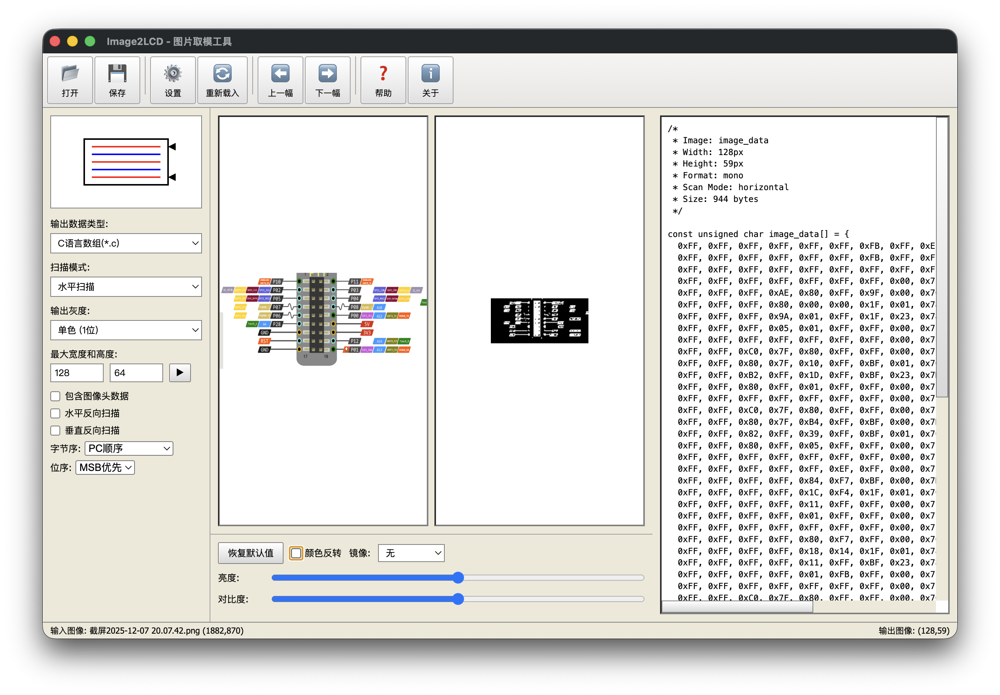
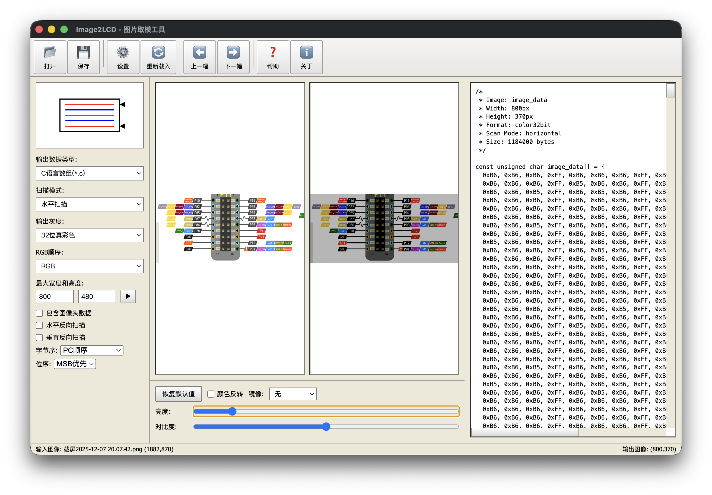

# Image2LCD Converter

A powerful desktop application and CLI tool for converting images to LCD display data formats, designed for embedded systems and microcontroller projects. Fully compatible with Image2Lcd format specifications.

关注微信公众号 AIDevLog 获取更多AI开发资讯和技术分享！


## Screenshots






## Features

- **10 Color Formats**: Monochrome, 4-gray, 16-gray, 256-gray, 256-color, 4096-color, 16-bit, 18-bit, 24-bit, 32-bit true color
- **Image Preprocessing**: Resize, rotate, mirror, brightness, contrast, inversion
- **Dithering Algorithms**: Floyd-Steinberg and ordered dithering for monochrome
- **4 Scan Modes**: Horizontal, vertical, horizontal-reverse-byte-vertical, data-vertical-byte-horizontal
- **Image2Lcd Headers**: HEADGRAY, HEADCOLOR, and PALETTE structures
- **Bit/Byte Order Control**: MSB/LSB bit order, PC/Reverse byte order in WORD
- **Multiple Output Formats**: C arrays, binary, hexadecimal text
- **Desktop GUI**: Full-featured Electron application with real-time preview
- **Comprehensive Testing**: 26 property-based tests with 100+ iterations each

## Installation

```bash
npm install
npm run build
```

## Usage

### Basic Usage

```bash
npm run cli -- <input-image> <output-file> [options]
```

### Examples

Convert an image to monochrome C array:
```bash
npm run cli -- logo.png output.c --format mono --width 128 --height 64
```

Convert with dithering:
```bash
npm run cli -- photo.jpg output.c --format mono --dithering
```

Convert to RGB565 binary:
```bash
npm run cli -- image.png output.bin --format rgb565 --output-format bin
```

Apply preprocessing:
```bash
npm run cli -- input.png output.c --brightness 20 --contrast 10 --rotation 90
```

### Options

| Option | Description | Default |
|--------|-------------|---------|
| `--format <type>` | Color format: mono, rgb565, rgb888, grayscale | mono |
| `--width <pixels>` | Maximum width | 128 |
| `--height <pixels>` | Maximum height | 128 |
| `--output-format <type>` | Output format: c, bin, hex | c |
| `--identifier <name>` | C array identifier name | image_data |
| `--dithering` | Enable dithering for monochrome | false |
| `--invert` | Invert colors | false |
| `--brightness <value>` | Adjust brightness (-100 to 100) | 0 |
| `--contrast <value>` | Adjust contrast (-100 to 100) | 0 |
| `--rotation <degrees>` | Rotate image (0, 90, 180, 270) | 0 |

## Color Formats

### Monochrome (mono)
- 1 bit per pixel, 8 pixels per byte
- Ideal for simple LCD displays
- Supports dithering for better grayscale representation

### 4-Gray (gray4)
- 2 bits per pixel, 4 pixels per byte
- 4 grayscale levels

### 16-Gray (gray16)
- 4 bits per pixel, 2 pixels per byte
- 16 grayscale levels

### 256-Gray (grayscale)
- 8 bits per pixel
- 256 shades of gray

### 256-Color (color256)
- 8 bits per pixel with palette
- Supports RGB332, grayscale, or custom palettes
- Optional PALETTE structure output

### 4096-Color (color4096)
- 12 bits per pixel (4 bits per component)
- Two formats: 12-bits-3-bytes or 16-bits-WORD

### 16-bit True Color (color16bit)
- RGB565: 5R-6G-5B (16 bits)
- RGB555: 5R-5G-5B (15 bits)

### 18-bit True Color (color18bit)
- 6 bits per component
- Two formats: 6-bits-low-byte or 6-bits-high-byte

### 24-bit True Color (color24bit)
- 8 bits per component (RGB888)
- Configurable RGB component order

### 32-bit True Color (color32bit)
- 8 bits per component + alpha channel
- Configurable RGB component order

## Output Formats

### C Array (c)
Generates a C source file with:
- Metadata comments (dimensions, format, size)
- Const unsigned char array declaration
- Hexadecimal values with proper formatting

Example output:
```c
/*
 * Image: image_data
 * Width: 64px
 * Height: 64px
 * Format: mono
 * Scan Mode: horizontal
 * Size: 512 bytes
 */

const unsigned char image_data[] = {
  0xFF, 0xFF, 0xFF, 0xFF, 0xFF, 0xFF, 0xFF, 0xFF,
  0xFF, 0xFF, 0xFF, 0xFF, 0xFF, 0xFF, 0xFF, 0xFF,
  // ... more data
};
```

### Binary (bin)
Raw binary data suitable for direct loading into memory or flash storage.

### Hexadecimal Text (hex)
Human-readable hexadecimal values with 0x prefix, useful for debugging.

## Architecture

The project follows a clean architecture with three main service layers:

### ImageProcessor
Handles image preprocessing operations:
- Resize with aspect ratio preservation
- Brightness and contrast adjustment
- Rotation (90°, 180°, 270°)
- Color inversion
- Dithering (Floyd-Steinberg, ordered)

### ImageConverter
Core conversion engine:
- Color format conversion
- Scan mode transformation
- Preprocessing pipeline integration

### DataFormatter
Output generation:
- C array formatting
- Binary output
- Hexadecimal text formatting
- Header file generation
- Byte order handling

## GUI Application

Launch the desktop GUI:

```bash
npm start
```

The GUI provides:
- Real-time image preview (original and converted)
- All color format options with format-specific controls
- Scan mode visualization
- Brightness and contrast sliders
- Mirror controls (horizontal, vertical, both)
- Bit/byte order configuration
- Image2Lcd header generation
- Code preview panel
- Save to C array or binary file
- About dialog with application information

## Testing

The project includes comprehensive property-based testing using fast-check:

```bash
# Run all tests
npm test

# Run tests in watch mode
npm run test:watch

# Run tests with UI
npm run test:ui
```

### Test Coverage
- **26 property-based tests** with 100+ iterations each
- Tests cover all preprocessing operations (resize, brightness, contrast, rotation, inversion, dithering, mirror)
- Tests validate all 10 color format conversions
- Tests ensure output format correctness (C array, binary, hex)
- Tests verify round-trip operations
- Tests validate Image2Lcd header structures (HEADGRAY, HEADCOLOR, PALETTE)

## Development

### Project Structure
```
src/
├── cli.ts                      # Command-line interface
├── main/                       # Electron main process (for future GUI)
│   ├── main.ts
│   ├── ipc.ts
│   └── preload.ts
├── renderer/
│   ├── services/               # Core business logic
│   │   ├── imageProcessor.ts
│   │   ├── imageConverter.ts
│   │   └── dataFormatter.ts
│   └── types/
└── shared/
    └── types.ts                # Shared type definitions
```

### Building

```bash
npm run build
```

### Running Tests

```bash
npm test
```

## Requirements

- Node.js 18+
- npm or yarn

## Dependencies

- **sharp**: High-performance image processing
- **typescript**: Type-safe development
- **vitest**: Fast unit testing
- **fast-check**: Property-based testing
- **electron**: Desktop application framework (for future GUI)

## Image2Lcd Compatibility

This tool is fully compatible with the Image2Lcd format specification:

- **HEADGRAY Structure**: 6-byte header for mono/gray4/gray16/color256 formats
- **HEADCOLOR Structure**: 8-byte header for color4096/16bit/18bit/24bit/32bit formats
- **PALETTE Structure**: Optional palette data for 256-color format
- **Scan Mode Encoding**: Bits 0-1 for scan mode, bit 4 for byte order, bit 5 for bit order, bits 6-7 for scan direction
- **All Scan Modes**: Horizontal, vertical, horizontal-reverse-byte-vertical, data-vertical-byte-horizontal
- **Bit/Byte Order**: MSB/LSB first within byte, PC order/Reverse order for WORD formats

## Future Enhancements

- Batch processing support
- Custom color palette editor
- Animation support (GIF frames)
- Drag-and-drop interface
- Preference persistence
- Keyboard shortcuts

## License

ISC

## Contributing

Contributions are welcome! Please ensure all tests pass before submitting pull requests.

## Source Code and Downloads

源码地址: https://github.com/build-your-own-x-with-ai/Image2Lcd

下载地址: 链接: https://pan.baidu.com/s/1hjvHDnAHsCuQhaC5K1LMeQ?pwd=3kxq 提取码: 3kxq

## Acknowledgments

Built with property-based testing methodology to ensure correctness across all input combinations.
